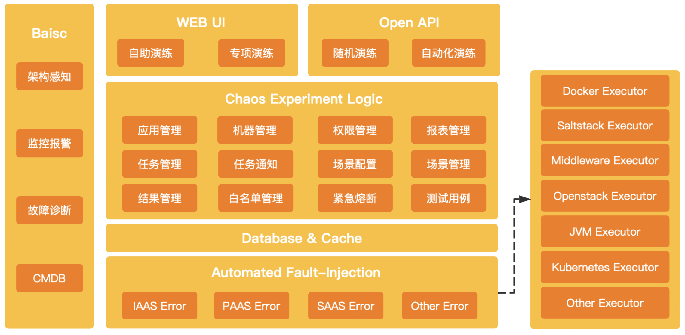
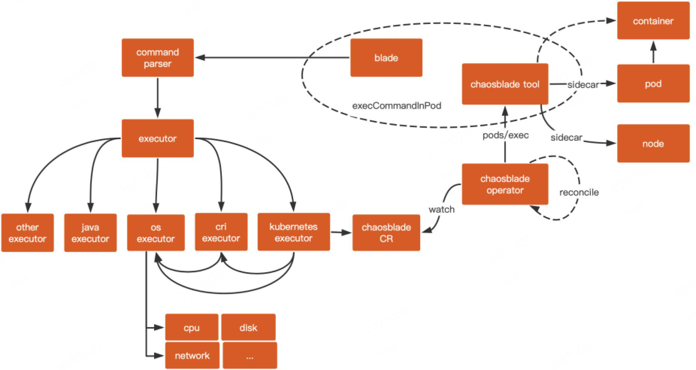
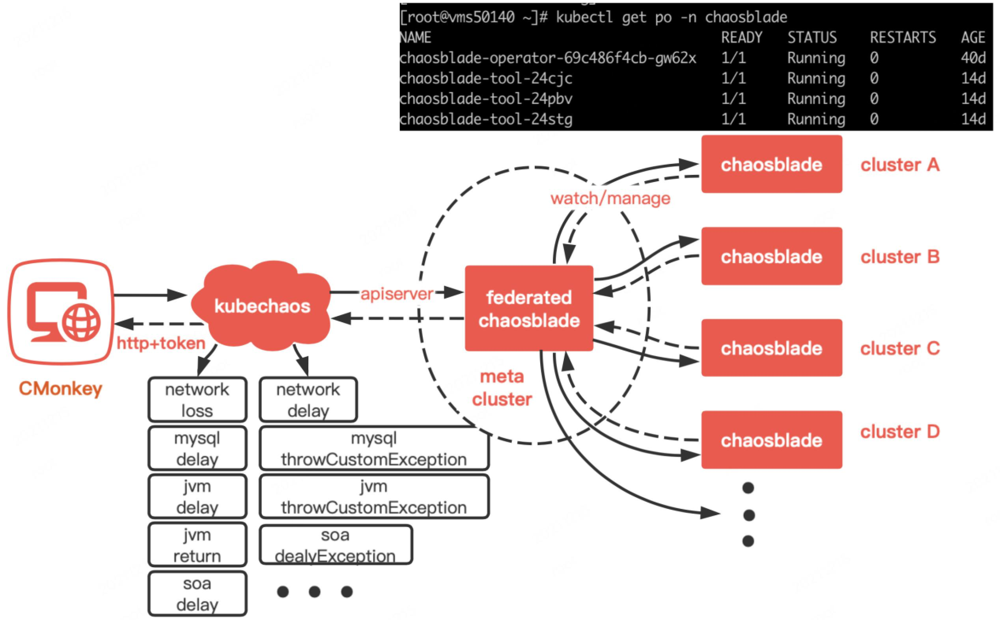
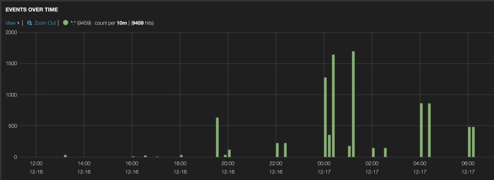
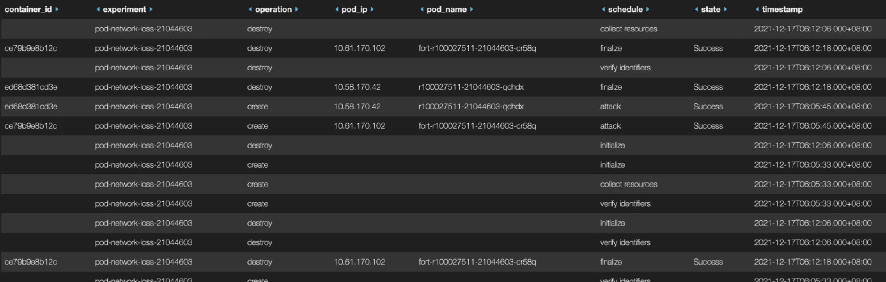

> 转载请保留链接 ;)

## 前言
携程大部分应用已经完成容器化改造，生产环境在线应用类型的容器数量已经达到 16w+ ，每周有数千次的生产环境发布，承载着各BU的核心业务。在多元化的业务场景中，微服务架构提高了开发效率和灵活性，但同时各个服务之间或多或少存在着强弱依赖，从而引入了更多的不确定性和复杂性。为了尽可能多地在异常行为触发之前识别风险，减少故障发生时所带来的严重后果，保持稳定的用户体验，自 2019 年 5 月至 2020 年 3 月底，公司内部成功实施了“流浪地球”项目，通过故障演练来验证平台各产品线应用的 Set 系统化部署的可靠性和高可用，其中最核心的一环就是模拟断网和真实断网。继“流浪地球”项目之后，故障演练趋于常态化，带来的思考便是如何改进演练的手段和丰富其多样性？
### 一、 混沌工程
在长期的演练过程中，我们不再满足于传统的单一的故障注入，而是需要一套体系化的标准和经过多方实践的科学的方法论，因此对混沌工程这个领域学科进行了积极地探索。通过主动攻防、主动演练和爆炸半径的自由把控， 把故障以场景化的方式沉淀，以可控风险和可控成本在线上模拟故障，提高故障的自愈能力。目前，公司常规化的演练场景可以抽象为五大类：访问入口类、应用类、数据类、系统和网络等基础设施类。用户通过网络中心自研的 CMonkey 平台，自助创建和运行混沌实验，比如网络丢包、延时、中断等，尽可能准确且及时地将系统异常检测、监控报警等反馈给用户，从而降低混沌实验的风险和操作复杂度。

<center>图 1-1  CMonkey 平台多样化的故障演练</center>

### 二、ChaosBlade引入
### 2.1 POC测试
在混沌工程实践初期，对 k8s 容器的演练基本上都是模拟网络层的丢包，利用 linux 下的 TC 命令来进行流量的控制。由于绝大多数容器内部没有 NET_ADMIN 权限来执行 TC ，所以我们利用 veth pair 在其部署节点一侧的指定网卡来执行命令。在 k8s 集群内，每个 pod 有唯一的 name ，CMonkey 平台通过指定其 name 或者 ip ，然后调用 API 去数据库获取容器相关的具体信息，比如集群信息、pod 信息、部署节点信息、网卡信息等，如何保证 DB 中数据的准确性成为了长期困扰我们的痛点。
老的方案除了可靠性差以外，还是从一个传统的设计模式实现的，并不符合云原生架构的理念和原则。经过一系列调研发现，开源的混沌演练工具 ChaosBlade 仅仅需要以 CRD 的方式添加到集群中，其支持的故障注入场景相当丰富，且社区相对活跃，对当前携程 k8s 系统架构的适配性、灵活性和可扩展性都较为便捷。
自 2019 年 12 月底开始，针对 ChaosBlade 做了一次 POC ，发现其模拟 100% 丢包断网是完全可行的，因而正式开始着手于基于 ChaosBlade 容器故障演练的开发。
### 2.2 k8s容器网络层面故障注入原理
ChaosBlade 在集群中的部署非常简单，这里我们使用官方提供的 helm 安装方法。从图 2-1 可以看到，成功部署后会启动两种类型的 pod ：  chaosblade-operator 和 chaosblade-tool 。
 operator 用于控制和管理 blade 这个资源的创建、更新和删除； tool 以 pod 的方式运行在每一个需要演练的 node 节点上，作为一个 daemon 守护进程。当然， tool 并不是必须部署的，只有涉及到容器层面或者网络层面的故障注入才需要用到它。

<center>图 2-1  ChaosBlade 在 k8s 中的运行状态</center>

下面，针对我们的主要演练场景容器断网（丢包100%），简单了解一下其底层的实现原理。

<center>图 2-2  ChaosBlade 针对 pod 网络故障注入原理</center>

从图2-2可以看出，通过声明式的实验场景配置，创建相应的 ChaosBlade CR ，operator 监听到该资源的创建/更新/销毁事件便会进行 reconcile ，选择对应场景的 controller ，进而调用相应的 executor （ pod 、node* 或者 container ）。如果是 pod 或者 container 的网络场景，便会以 pods/exec 的方式进入 tool 容器，执行：
```shell
/opt/chaosblade/blade create docker network loss --interface eth0 --percent 100 --image-repo chaosblade/chaosblade-tool --image-version 1.3.0 --container-id edd560912951
```
该命令会调用 docker client 启动一个与目标容器共享网络空间的 sidecar 容器，通过对 sidecar 容器的网络故障注入和恢复来等效实现对目标容器的注入和恢复。命令下发后，通过 command parser 解析至对应的 executor ，这里会调用 kubernetes executor 。而 os excutor 、 cri executor 和 kubernetes executor 自左向右是层层复用的，针对网络丢包的实验场景， kubernetes executor 则会复用 cri executor 和 os executor ， cri executor 实现了如何启动一个 sidecar 容器的逻辑， os executor 则实现了底层的 network 故障注入。这里，我举例的是 group 级别的断网，由于目前公司 k8s 的架构是一个 pod 仅对应一个业务容器，所以对 pod 实施断网，即可表示对该容器断网。

### 三、落地挑战
### 3.1 多集群问题
携程的整个 k8s 架构采用多 IDC 多集群的部署，从用户角度来看，无需关心其业务容器具体落在哪套集群的哪个节点上。事实上，用户在申请 group 创建多实例时，也仅能指定 IDC ，最终容器实例将分散在不同集群。目前，容器支持单实例级别和 group 级别的演练，即用户可以指定该容器的具体 ip ，或者也可以指定该容器所属的 group ，从 CMonkey 发起演练请求，设置演练开始时间和结束时间，一旦任务设置成功，则会自动进入队列等待。如果用户仅仅指定了 group ，那么该 group 下的所有容器实例将被演练。基于这样的情况，我们每套集群都得部署 ChaosBlade ，同时需要一个中间件服务去接收 CMonkey 传过来的参数进行相应的逻辑处理，然后再批量地去不同集群创建 ChaosBlade CR ，最后利用 chaosblade-operator 去真正地干活。

### 3.2 调用链路设计

<center>图 3-1 基于 chaosblade 的故障注入调用链路设计</center>
考虑到上述多集群的问题，目前采取的方案是基于 kubefed v2 联邦机制，利用 Federation API 资源（ federatedChaosBlade ）来统一管理多个集群的 blade 资源。整个调用链路如图 3-1，kubechaos 是基于 Gin 中间件开发的 REST API ，实现的功能包括：

1）利用 k8s informer 机制缓存各集群的相关资源，比如 pod ，给故障注入提供必要的参数信息，比如 names、namespace、container-ids 等；

2）基于必要参数创建 federatedchaosblade 资源模板；

3）创建/删除/查询 federatedchaosblade 资源，提供详细的状态 response ；

4）认证鉴权；

5）日志记录；

### 3.3 应急预案设计
在调用 ChaosBlade 原生支持的故障恢复命令后，如果不能及时删除故障实验场景，那么将会造成容器实例长期处于不可用状态，无疑会严重威胁应用的稳定性。因此，这里提供了一种帮助容器实例快速恢复网络的补偿方案，从而提升用户体验和演练的可靠性。
这里借助 nsenter 进入指定容器的网络命名空间，使用宿主机的命令调试容器网络。该方法被集成到了 kube-chaos ，对外暴露 API 供用户调用，具体做法如下：

1）根据请求参数（ ip/group ）获取容器 id 和宿主机信息；

2）获取容器在宿主机上的进程号 PID ：

```
docker inspect edd5609129 | jq '.[].State.Pid'
```
3）执行删除命令：

```
nsenter -t <PID> -n tc qdisc del dev eth0 root netem
```
### 3.4 接入监控
在趋于常态化的演练过程中，及时准确的监控告警无疑是非常重要的。目前，基于 ChaosBlade 的生产环境断网演练日均容器数量达到了 200+，从 2021 年 10 月份开始，至今演练次数达到 80+，几乎覆盖了生产环境所有的非核心应用类型的容器。按照我们的需求，整合了 chaosblade-operator 生成的日志信息，并通过filebeat 收集到携程统一监控平台，如图 3-2，3-3 。通过日志的收集和分析，可以直观地看到每日演练的时间和体量，也可以看到每个容器被演练的详细日志，若有失败，则会详细记录失败产生的原因，帮助技术人员快速定位问题和及时止损，从而降低自动化演练的复杂度。

<center>图 3-2  24 小时内 group 级别容器演练情况统计</center>


<center>图 3-3  被演练容器的详细日志链路设计</center>

### 四、总结与未来规划
携程云平台先前在对容器模拟断网故障时强依赖第三方接口提供的数据，而且需要结合不同的网络技术 neutron 和 cilium ，制定不同的 TC 脚本并提前注入到容器所在宿主。一方面数据稳定性和可靠性得不到保证，另一方面随着 linux 内核的升级，脚本也出现了不能生效的现象。为了能够持续进行容器断网演练，ChaosBlade 成为了我们的重点研究对象，并成功落地携程。
在推动 ChaosBlade 全环境部署的过程中，需要制定可靠的策略来合理地控制实验的爆炸半径；需要设计最佳部署方案来精简整个调用链路和保证其高效性和稳定性；需要对整个线上稳定性的问题做全方位的度量，包括监控预案和报警措施；需要具备扎实的业务能力，在业务逻辑发生错误时，关注其是否能够自愈或是通过监控进行及时有效地降级或补救。通过持续的演练，来帮助发现产品线内部的核心是否高可用，内部依赖关系是否正确。
混沌工程的核心思想是通过主动注入故障的手段，发现系统中威胁到稳定性的风险点，提升基础设施的韧性。携程未来将会在这一领域进行更深入的探索，基于 ChaosBlade 提供的丰富的混沌能力，不再仅仅局限于容器断网，目前已经验证了容器JVM故障注入的能力，并自研了部分实验场景，从而构建更加全面且成熟的混沌实验平台。
